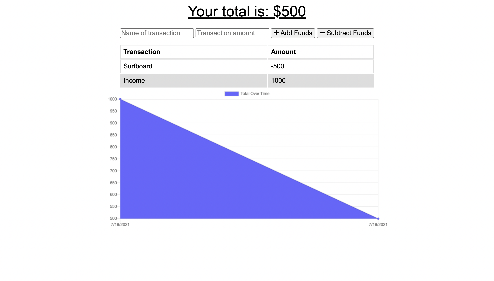

# Budget Tracker

## Table of Contents
[Description](#description)\
[Motivation](#motivation)\
[User Story](#user-story)\
[Technologies](#technologies)\
[License](#license)\
[Process](#process)\
[Screen Shot](#screen-shot)\
[Links](#links)


## Description

The user is able to add expenses and deposits to their budget with or without a connection. When entering a transaction offline the users account balance is updated and the transactions are tracked.  When back online the transactions are still tracked and the balance is up to date.

Offline Functionality:

  * Enter deposits offline
  * Enter expenses offline
  * Balance is up to date


## Motivation

Giving users a fast and easy way to track their money is important, but allowing them to access that information anytime is just as important. Having offline functionality is paramount to helping users stay on track with their budget.

## User Story

```md
AS AN avid traveller
I WANT to be able to track my withdrawals and deposits with or without a data/internet connection
SO THAT my account balance is accurate when I am traveling
```

## Technologies

* HTML, Bootstrap, & CSS
* JavaScript
* MongoDB
* Dependencies: Compression, Express, Lite-Server, Mongoose, and Morgan


## License

[MIT License](https://choosealicense.com/licenses/mit/)

## Process

* This project began with some starter code.
* Based on the starter code I created the db.js to work with IndexedDB to store data offline and pass that data into the database once online, then using a service worker and manifest to store files to render the website in the cache.
* The biggest challenges for this project I had was getting the service worker to function properly.
* The successes for this project was getting a better getting more exposure to working with IndexedDB, service worker, and manifest file to create a PWA.

## Screen Shot



## Links

Repository: https://github.com/harviator/budget-tracker \
Deployed: https://budget-tracker-steel.vercel.app/
